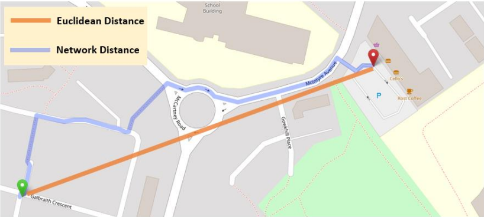
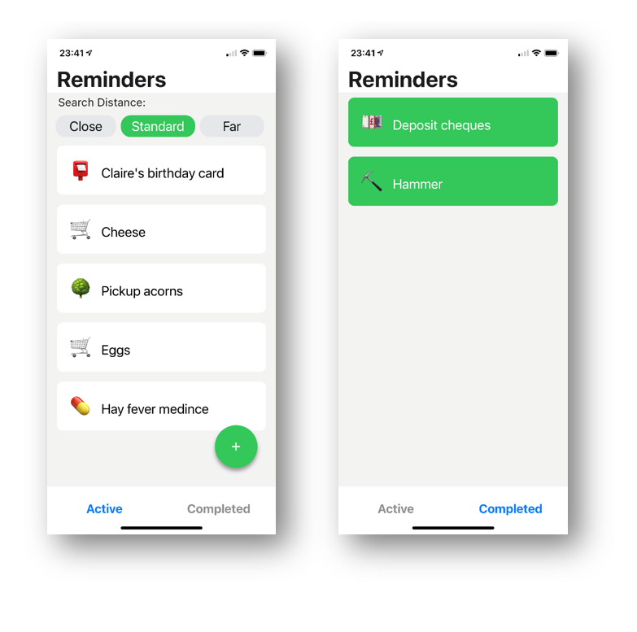
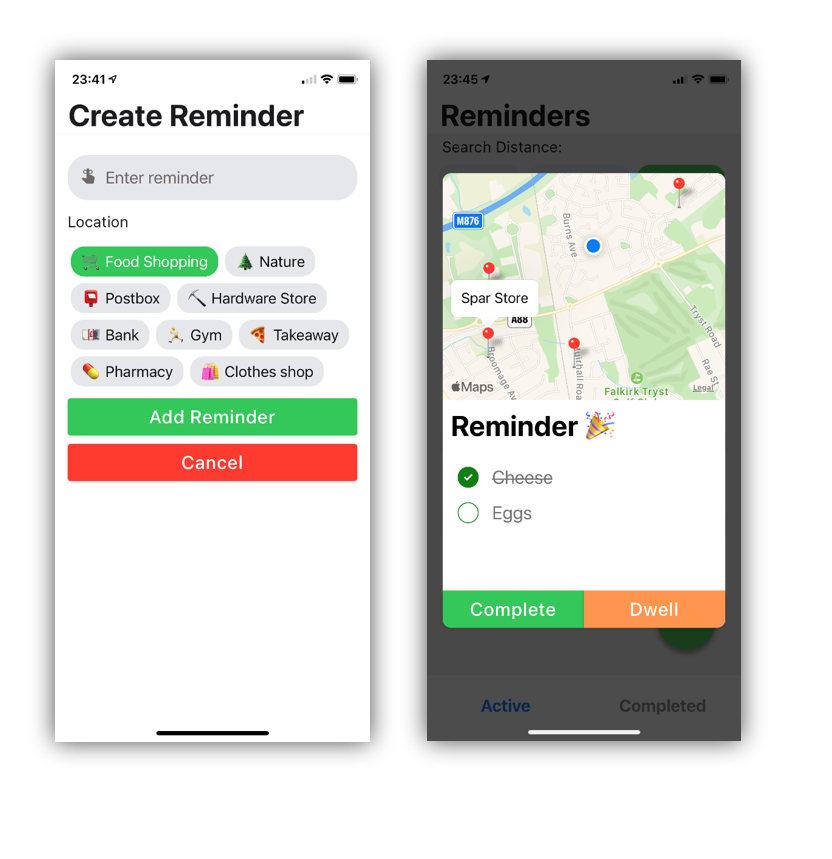

# location-aware-reminders
 
A reminder application that uses generic location types to trigger reminders.
 
 _Instead of creating a reminder to buy milk the next time I’m at the local Tesco, remind me to buy milk any time I walk past a supermarket/corner shop/minimarket_.

## Spatial techniques used

Two different spatial techniques were used to determine how close a user is to a potential point of interest: the Euclidean and Network distance.

 

## The result

[An example of a reminder being triggered spatially.](https://www.youtube.com/watch?v=sTqs4NIJo8A)

[An example of adjusting the search distance. ](https://www.youtube.com/watch?v=6D91wFN6oeo)

